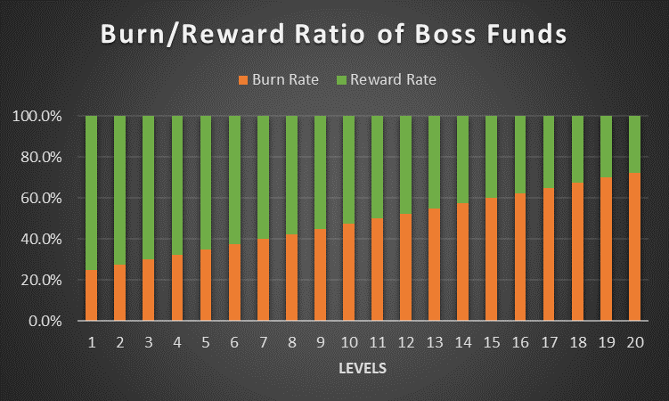

# Boss Rewards

Some portion of the funds of the bosses burns. This porting starts at 25% in level 1 and increases by 2.5% at each level. At level 20, the burning rate is 72.5%. The remaining funds are the Boss Rewards which will be distributed among heroes, backers, selectors, and creators.&#x20;

Boss rewards decrease linearly but the Backer Rewards increase exponentially which increases the funding of the bosses exponentially as well. Therefore, even though the reward ratio decreases as you proceed to upper levels, the earnings of all participants increases including holders due to high burning rates!

## Distribution of Boss Rewards

As you see above, boss rewards are 75% of the funds for the level 1 boss and 27.5% for the level 20 boss. These rewards will be distributed among 4 roles in the game; Heroes, Backers, the Selector, and the Creator.

* 50% - To heroes who fukc the boss (Boss's treasury)
* 38% - To backers who funded the boss&#x20;
* 10% - To the elector who selected that boss
* 2% - To the creator who minted that boss

As you can see, backers get back some of their funds through Boss Reward. This gives us an option to adjust the economics of the game if we need. These distribution ratios can change over time to have sustainable economics.&#x20;


The actual reward for the backers is the [Backer Rewards](backer-rewards.md). Boss rewards are a partial payback for the backers.

